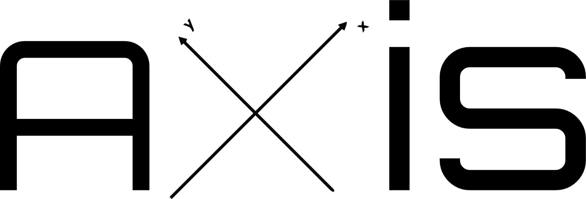
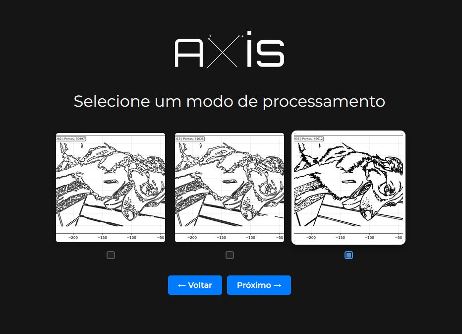
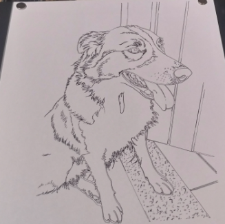
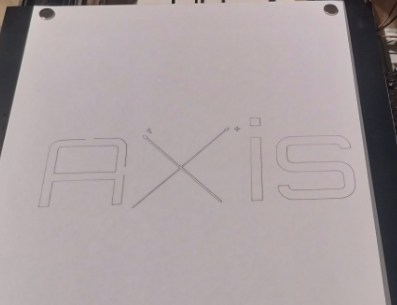
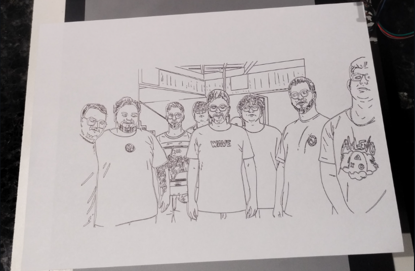
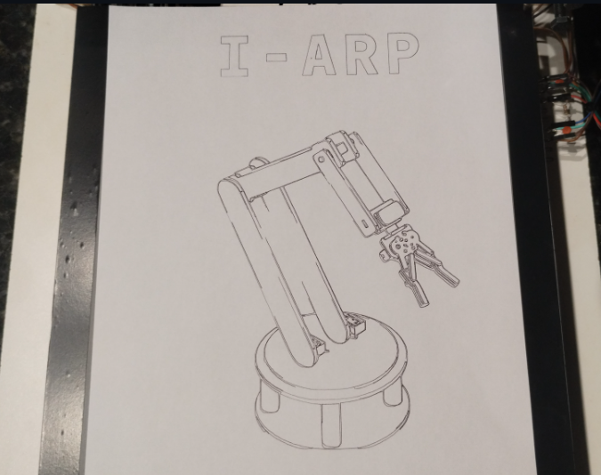
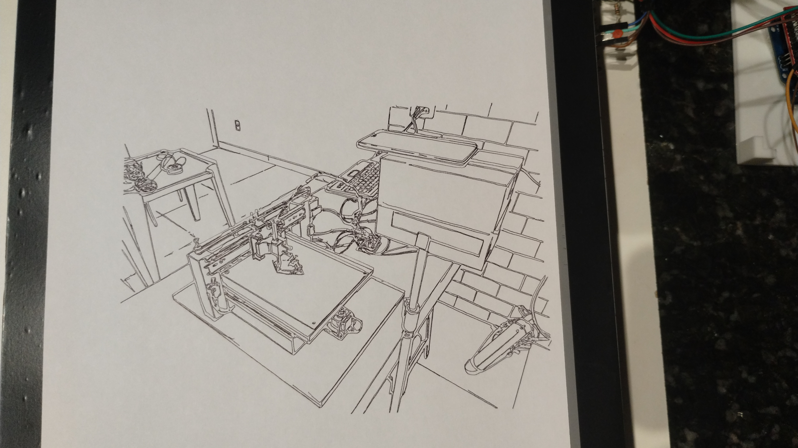

Um projeto de uma máquina CNC de 3 eixos, desenvolvida com foco em baixo custo e acessibilidade.
---

### **1. Introdução**

O projeto Axis foi concebido a partir do interesse em criar projetos que integram software e hardware de forma funcional e interativa. Utilizando os conhecimentos adquiridos no curso de Engenharia de Computação, o desenvolvimento foi realizado do zero, desde a modelagem 3D das peças até a criação de um software customizado para processamento de imagem. A motivação para o projeto partiu da constatação de que o acesso a máquinas CNC é dificultado por dois fatores principais: o custo elevado dos modelos comerciais e a carência de projetos com documentação moderna e de fácil acesso.

---

### **2. Objetivos**

O Axis foi projetada para ser uma máquina de baixo custo e acessível. O objetivo principal é oferecer um produto interativo e escalável. Sua estrutura modular permite que, com poucas modificações, a ferramenta seja convertida em uma gravadora a laser ou, com a adição de um eixo, adaptada para funcionar como uma impressora 3D, expandindo significativamente suas capacidades.

O protótipo funcional valida a proposta do projeto com especificações técnicas testadas. A máquina dispõe de uma área de trabalho útil de **300x240mm** e atinge uma velocidade de deslocamento de **2500 mm/min**, condição na qual os motores de passo se estabilizam a uma temperatura de 50°C. O sistema demonstra alta precisão, sendo capaz de produzir desenhos de alta qualidade com um erro de posicionamento mínimo, confirmando sua viabilidade como ferramenta funcional.

---

### **3 Fluxo de Trabalho: Do Digital ao Físico**
#### **O Software Axis em Ação**

A principal característica do projeto Axis é seu software customizado que transforma imagens em G-Code. O comparativo abaixo ilustra o fluxo de trabalho completo, desde a imagem original até o resultado final desenhado pela máquina.

### **Comparativo Visual do Processo**

| **Entrada** | **Processamento** | **Resultado** |
|-------------|-------------------|---------------|
|  |  |  |
| **Imagem Digital** | **Interface Axis** | **Desenho Físico** |
| Arquivo de entrada (PNG/JPG/JPEG) | Vetorização e preview em tempo real | Produto final executado pela CNC |

> **Legenda:** Fluxo completo desde a entrada digital até a materialização física.

---

## 4 Galeria de Projetos

A seguir, uma galeria com outros trabalhos e testes realizados com a máquina, demonstrando sua versatilidade e precisão em diferentes tipos de desenho.

### 4.1 Logo do Projeto

  
   
   
  <em>Figura 1: Nesta imagem, é possivel observar o nivel de detalhamento alcançado pelo projeto.</em>

### 4.2 Desenho de animal

  
   
  <em>Figura 3: Desenho da cachorra Luna.</em>

### 4.3 Desenho de pessoas

  
   
  <em>Figura 4: Toda a equipe de desenvolvimento do projeto.</em>

### 4.4 Ilustração  do projeto anterior

  
   
  <em>Figura 5: Ilustração do projeto anterior, uma mão robótica.</em>

### 4.5 Desenho de ambiente

  
   
  <em>Figura 6: Desenho focado na perspectiva.</em>

---

## Criadores

O projeto não teria sido possível sem essas pessoas:

| Avatar | Nome | Contribuição |
| :---: | --- | --- |
|  | [Guilherme Augusto](https://github.com/gui200428) | Desenvolvedor frontend/backend, modelagem 3D, prototipagem, montagem do hardware e documentação. |
|  | [João Francisco B. Ferreira](https://github.com/jfscripts) | Desenvolvedor backend / Impressão 3D / Revisão |
|  | [Thales Enrico S. da Silva](https://github.com/Thales-Enrico) | Apresentação do Projeto / Montagem do hardware |
|  | [Vitor Ronald Barbist](https://github.com/ronald-barbist) | Desenvolvedor backend / Montagem do hardware |
|  | [Luccas Henrique R. da Silva](https://github.com/LuccasHenrique13) | Desenvolvedor frontend / Montagem do hardware |
|  | [Miguel Arcanjo B. Motta](https://github.com/Miguelmotta) | Designer |
|  | [Matheus Gonzalez](https://github.com/Mgonzalez980) | Montagem do hardware |
|  | [Higor Robert Barbist](https://github.com/higorrb) | Desenvolvedor backend / Montagem do hardware |

 